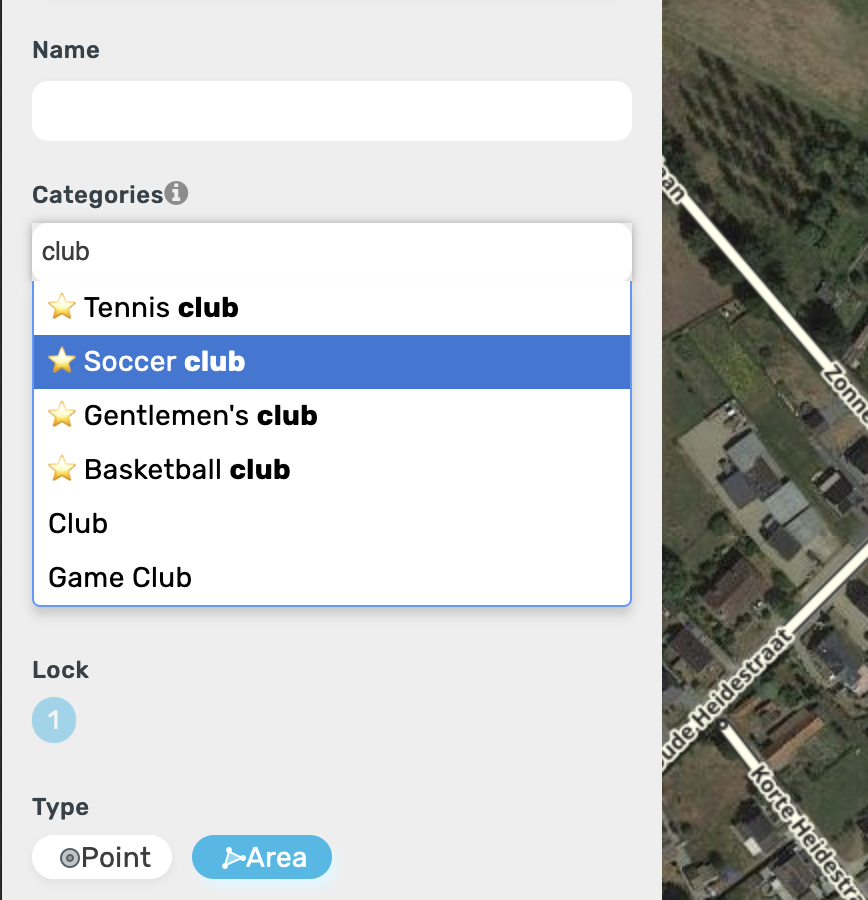
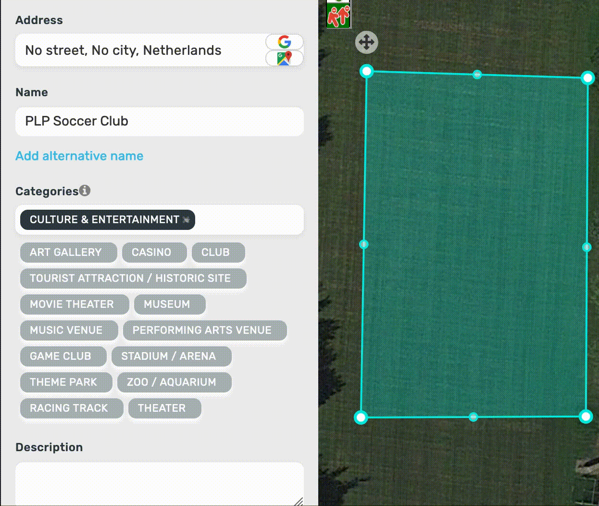

# WME Advanced Categories
WME Advanced Categories is a userscript for Waze Map Editor. The script introduces (country specific) advanced categories to Waze Map Editor. 

## Why?
Plenty of times, when editing a place in WME, you'll not be sure which place category to use. This script aims to streamline the categories that are used for a community.  
By adding loads of new 'advanced categories' we can make sure Map Editors use the correct category for a place.  

For example: abortion clinics, dentists and estate agents are not categories that are available in WME by default. Thus uncertainty may exist amongst editors on which Waze-category to use. 

## Contributing
Feel free to submit a pull request to add support to your country, or to change the advanced categories.

## Examples
_(1) Searching for an advanced category_  
  
  
_(2) Setting a place to 'Voetbalclub' (Soccer Club in Dutch)_  
  

## Install
Click [here](https://github.com/musa11971/WME-Advanced-Categories/raw/master/wme-advanced-categories.user.js) to install the userscript.